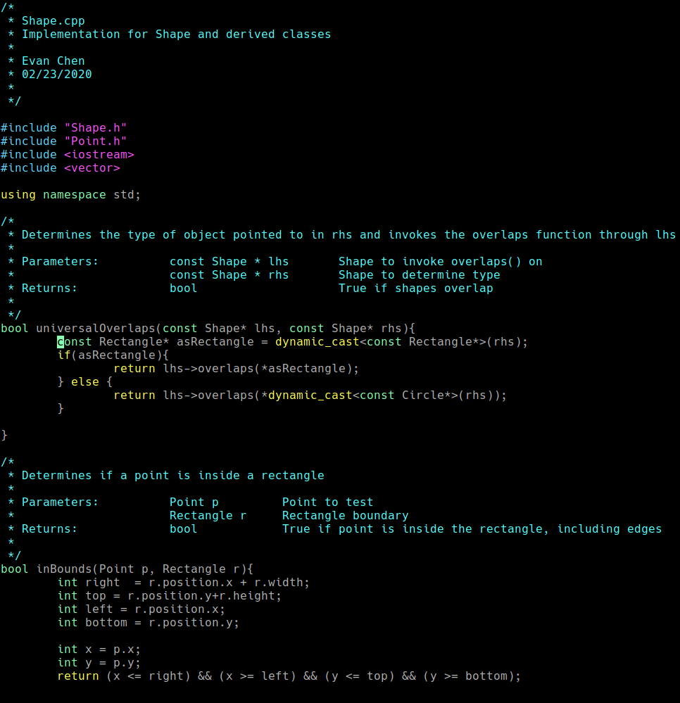
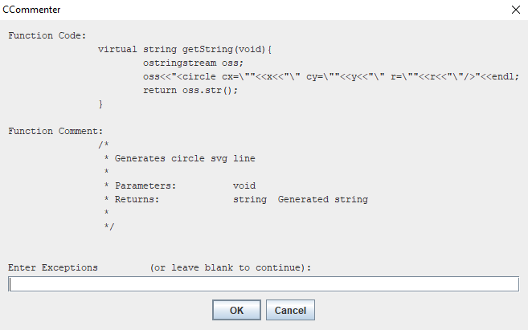

# CCommenter
Chen's C and C++ Commenter

CCommenter is a Java program that aids in C and C++ Program commenting by prompting for file and function information then automatically formatting and inserting comments. CCommenter inserts comments in [this format](https://docs.google.com/document/d/1Et_V2ugeFaKcHvgTaO4vOvHinL16Sp5139q-AcoYAYA/edit?usp=sharing) which is based on [Matthew Bishop's Program Style](http://nob.cs.ucdavis.edu/classes/ecs036a-2019-04/general/progstds.html).

# Features

 - Autofills discovered information including filename, date, function parameters, and function return
 - Matches indentation to code
 - Newline formatting
 - Selective comment insert
 
 # Usage
 
  
 
 1. Download the [latest release](https://github.com/hybridCECA/CCommenter/releases)
 2. Edit ccommenter_config.txt (optional)
 3. Run CCommenter.jar
 4. Choose the source file and enter information
 5. Review the output file and rename it to the original file
 6. Done!
